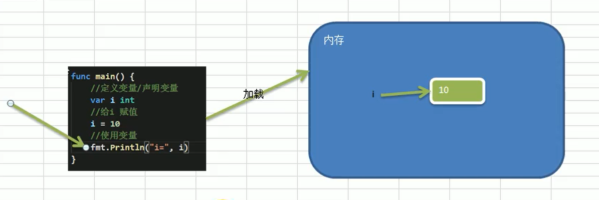

# Golang变量

## 为什么需要变量

一个程序就是一个世界  
**变量是程序的基本组成单位**  不论是是用那种高级程序语言编写程序,变量都是其程序的基本组成单位  

## 概念

> 变量相当于内存中一个数据存储空间的表示,你可以吧变量看作是一个房间的门牌号,通过门牌号我们可以找到房间,同样的道理,通过变量名可以访问到变量(值)

## 变量使用的基本步骤

1. 声明变量(定义变量)
2. 非变量赋值
3. 使用变量

> [变量使用的基本步骤](../../基础篇/4.Golang变量/src/main/main.go)  

## 变量的使用注意事项和细节

[变量的使用注意事项和细节](../../基础篇/4.Golang变量/src/main/variable.go)  

1. 变量表示内存中的一个存储区域
2. 该区域有自己的名称(变量名)和类型(数据类型)
3. Golang变量使用的三种方式
   - 指定变量类型,声明后若不赋值,使用默认值
   - 根据值自行判断变了类型(类型推导)
   - 省略`var`,注意`:=`左侧的变量不应该是已经声明过的,否则会导致变异错误
4. 多变量声明  
   在编程中,有时我们需要一次性声明多个变量,Golang也提供这样的语法
5. 该区域的**数据值**可以在同一类型范围内不断变化  
6. 变量在同一个作用域(一个函数或一个代码块)内不能重名  
7. 变量 = 变量名 + 值 + 数据类型(每个变量都必须要包含变量三要素)
8. Golang的变量如果没有赋初始值,编译器会使用默认值,比如int默认值0,string默认值为空串,小数也是默认为0  

## 变量在代码运行中的变化  

>   
> 前提:所有的代码要运行起来必须先**加载到内存中去**  
> 当运行到变量那一行的时候,在内存中会开辟出一个内存空间(数据空间),同时一个叫i的变量也生成了  
> 变量i会直接跟数据空间关联起来,当声明变量没有赋值的时候,其实i有一个默认值为0  
> 当赋值之后,计算机会通过i变量名,找到这个空间,并且把这个0改成10,最后输出  

## 变量的三种声明方式

 [使用方式实例](../../基础篇/4.Golang变量/src/main/main.go)

1. 指定变量类型,**声明后若不赋值,使用默认值**  
2. 根据值自行判断变量类型(类型推导)  
3. 省略`var`,注意 `:=` 左侧的变量不应该是已经声明过的,否则会导致编译报错  
4. 多变量声明:在编程中,有时我们需要一次性声明多个变量,Golang也提供这样的语法  
   - 可以一次性声明多个全局变量,在Go中函数外部定义变量  

## 变量的声明,初始化和赋值

1. 声明变量
   基本语法: var 变量名 数据类型  
   var a int 这就是声明了一个变量,变量名是a  
   var num1 float32 这也是声明乐一个变量,表示一个单精度类型的小数,变量名是num1  
2. 初始化变量
   在声明变量的时候,就赋值  
   var a int = 45 这就是初始化变量  
   使用细节,如果声明时就直接赋值,可省略数据类型  
   var b = 400
3. 给变量赋值
   比如你先声明了变量 var num int  
   然后,再给值 num = 780; 这就是给变量赋值  

## 程序中+号的使用

1. 当左右两边都是数值类型时,则做加法运算  
2. 当左右两边都是字符串,则做字符串拼接  

```go
//程序中+号的使用
var j int = 20
var r = i + j
fmt.Println("r = " ,r ) // 做加法运算

var str string = "str"
var str2 string = "str2"
var str3 = str + str2
fmt.Println("str3 = " ,str3 ) // 做拼接操作
```
