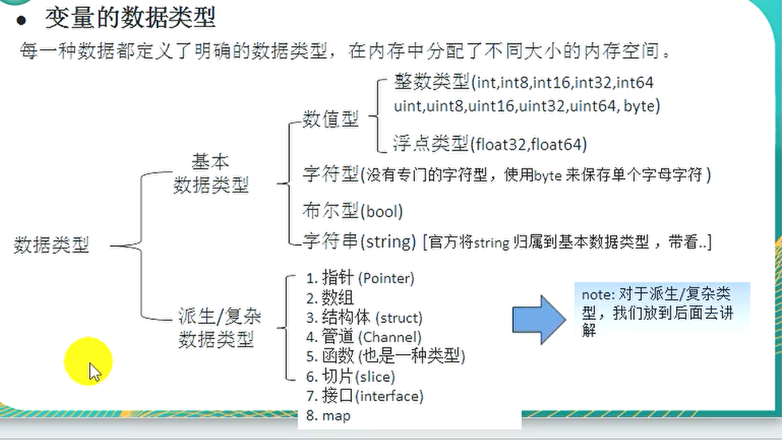

# Golang的数据类型

>   

基本数据类型  
> 数值型  
>> 整数类型(为了区分不同范围的整数类型,会在类型后加上数字表示) int,int8(8bit,1byte),int16,int32,int64 unit(u无符号,范围更大),unit8,unit16,unit32,unit64 byte  
>> 浮点类型 float32(单精度) float64(双精度)  
>
> 字符型--没有专门的字符型,使用byte来保存单个字符(不能保存汉字,go都是utf8,一个汉字三个字节)  
> 布尔型(bool)--只有false和true,其他字符是违法的  
> 字符串(string)--官方将string归属到基本数据类型  

派生/复杂数据类型  
> 指针(Pointer)  
> 数组  
> 结构体(struct)  
> 管道(Channel)  
> 函数(也是一种类型)  
> 切片(slice)  
> 接口(interface)  
> map  

## 整数类型

> 整数类型,就是用于**存放整数值**的,比如0,-1,2345  

类型 | 有无符号 | 占用存储空间 | 表数范围 |
---------|----------|---------|---------|
 int8     | 有       | 1字节 | -128~127     |
 int16    | 有       | 2字节 | -2^15~2^15-1 |
 int32    | 有       | 4字节 | -2^31~2^31-1 |
 int64    | 有       | 8字节 | -2^63~2^63-1 |
 uint8    | 无       | 1字节 | 0~255 (11111111 -> 2^8-1)        |
 uint16   | 无       | 2字节 | 0~2^16-1     |
 uint32   | 无       | 4字节 | 0~2^32-1     |
 uint64   | 无       | 8字节 | 0~2^64-1     |

### 整数类型的其他类型

类型 | 有无符号 | 占用存储空间 | 表数范围 | 备注 |
---------|----------|---------|---------|---------|
 int     | 有       | 32位系统4个字节  64位系统8个字节 |-2^31~2^31-1  -2^63~2^63-1 |  |
 uint    | 无       | 32位系统4个字节  64位系统8个字节 | 0~2^32-1  0~2^64-1 |  |
 rune    | 有       | 与int32一样（4字节） | -2^31~2^31-1 | 等价于int32,表示一个Unicode码 |
 byte    | 无       | 与uint8等价（1字节） | 0~255 | 当要存储字符时选用byte |

### 整数的使用细节

[整数的使用细节代码示例](./src/main/useDetailToInteger.go)  

1. Golang的整数类型分为:**有符号**和**无符号**,int/uint的大小和系统有关
2. Golang的整型默认声明为**int型**
3. 如何在程序中查看某个变了的字节大小和数据类型
4. Golang程序中整型变量在使用时,遵守保小不保大的原则,即:在保证程序正确运行下,尽量使用占用空间小的数据类型[如年龄]
5. bit:计算机中的最小存储单位,byte:计算机中基本存储单元  

## 浮点类型

Golang的浮点类型可以表示一个小数,比如123.4,7.8,0.12等  

### 浮点类型分类

[浮点数的使用细节代码示例](./src/main/useDetailToFloating.go)  

> 单精度和双精度主要的区别在于表示的范围和精度不一样

类型 | 占用存储空间 | 表数范围 |
---------|----------|---------|
 单精度float32 | 4字节 | -3.403E38~3.40.E38 |
 双精度float64 | 8字节 | -1.798E308~1.798E308 |

> 说明  

1. 关于浮点数在几期中存放形式的简单说明: 浮点数 = **符号位** + **指数位** + 尾数位  
2. 尾数部分可能丢失,造成精度损失 -123.0000901 (float64比float32的精度准确)
3. 浮点类型存储分为三部分,符号位+指数位+尾数位,在存储过程中,精度会有丢失

### 浮点类型的使用细节

1. Golang的浮点类型固定的范围和字段长度,不受具体OS的影响
2. Golang的浮点类型默认声明为float64类型
3. 浮点类型常量有两种表示形式  
   十进制数形式,如 5.12 0.512(必须有小数点)  
   科学计数法形式,如 2.1234e2 = 2.12 * 10^2 5.12E-2=5.12/10^2  
4. 通常情况下,应该使用float64,因为他比float32更准确
